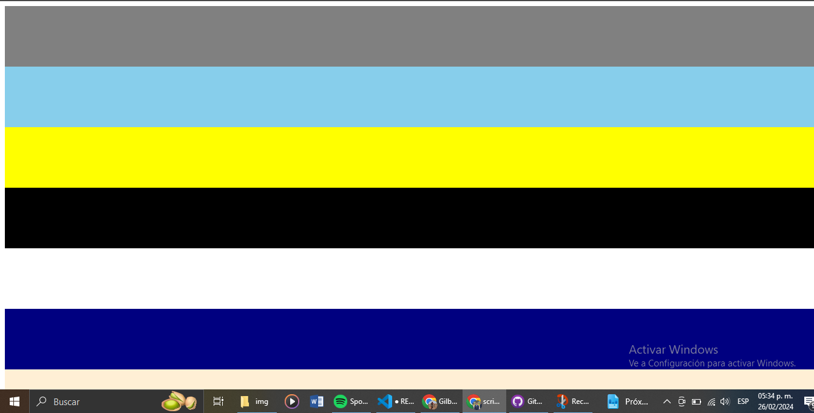

# Topicosde programacion 

## Este repositorio es de la clase de Tópicos Avanzados de Programación

### Donde se generaron los siguientes scripts: 

* #### La creacion de 10 contenedores con 100px de tamaño  y tendras un color aleatorio de nuestra estructura con 20 colores.

---
---
* #### utilizando el script anterior, agregamos la funcionalidad de que los colores que obtiene cada contenedor no se repitan entre ellos 

---
---
* #### La creacion de parrafos inteligentes, utilizando una estructura de palabras aleatorias generamos 5 parrafos que se creen aleatoriamente; estos deben tener un tamaño de 50 a 100 palabras, indicando al final del parrafo la cantidad de caracteres que contiene cada parrafo 

