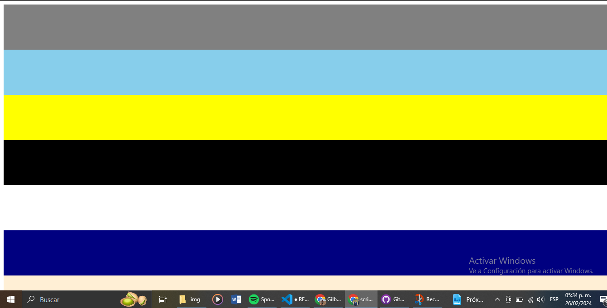

# script02
>   ### Declaramos el cuerpo de la pagina, donde agregaremos los contenedores
``` javascript
 const body = document.querySelector('body')
```
> ### Declaramos un arreglo con los diferentes colores que utilizaremos en los contenedores
```javascript
const colores = ['blue', 'red', 'yellow', 'green','gray', 'pink', 'black', 'white','orange','violet', 'rebeccapurple', 'olive', 'aqua', 'navy', 'teal','skyblue', 'royalblue', 'coral', 'gold', 'papayawhip']
```
>### Creamos un ciclo for, el que se repetira 10 veces; lo que este realizara es crear un contenedor, asiganandole un tamaño de altura de 100px; una vez creado utilizando la funcicion: 
```javascript
Math.floor(Math.random() * colores.length)
```
>### Para sacar un color random del arreglo, este elemento se guardara en en la vaiable indice

```javascript
for(let i=0; i<10; i++){
    const div = document.createElement('div')
    div.style.height = '100px' 
    const indice = Math.floor(Math.random() * colores.length)
    const colorUsado = colores[indice]
    div.style.backgroundColor = colorUsado
    body.appendChild(div) 
    colores.splice(indice,1)
}
```
> ### Finalmente el color la variable indice se coloca dentro del arreglo colores, para asi acceder a dicho color y asignarlo al contenedor; una vez asignado el color, se utiliza el metodo splice para eliminar el color utilizado del arreglo de colores y de esta manera evitar que se respitan los colores para asi agregar el contender al cuerpo de la pagina


